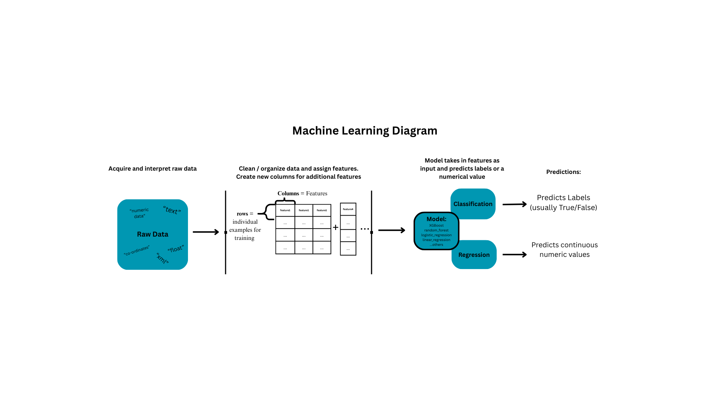

## HW4 -- Diagram and Machine Learning Explanation:

Machine learning operates by a process of a model taking in data in the form of various features. The model is trained on a portion of the dataset with features and their respective labels using that model's specific mathematical algorithm. The test portion of the data does not include labels, and the model makes a prediction as to what the label will be based on the features given.

Features are variables within a dataset that make up the input of a classifier or regression model. Not all features are seen in the raw data. Once raw data is organized into columns and rows, columns can be modified and added to the dataframe as new columns. The initial columns and new columns become the features that the model is trained on.

Labels are what a classification model is trained to predict. Labels are often in the form of True/False or 0/1.

The difference between classification and regression models is that classifiers predict labels and regression models predict a continuous numeric value.

Paramaters are variables that a model uses in its algorithm to predict labels from input features. As a model grows more complex, the number of parameters increase. 

Some models are extremely complex and the public does not have access to all of the details of how they function. These are referred to as black box models

Other models that exist may not be as complex, but their inner workings are available to the public. These are referred to as open box models.

